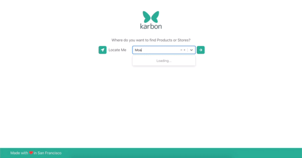

    

    <h2>Welcome to Karbon!</h2>
    <a href="https://karbon-web.dev.novichkov.dev/">Live Project Link 🔗 </a>

 

Karbon is an ecommerce project that provides live inventory of local stores to users nearby and our chrome extension drives traffic directly from amazon to these local stores. This codebase, the serverside codebase and the chrome extension codebase are maintained in a private organization. 

